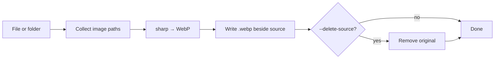

# aywebp

> Fast, zero-config CLI to convert images to WebP — one file or entire folders.

[](https://nodejs.org/)
[](LICENSE)
[](https://github.com/kakajan/AyWebP)
[](https://github.com/kakajan/AyWebP/pulls)

**aywebp** is a small Node.js command-line tool that turns JPEG, PNG, GIF, TIFF, BMP, and WebP files into optimized `.webp` images. Point it at a single file or a directory, tune quality, optionally recurse into subfolders, and optionally remove originals after a successful conversion.

Built with [sharp](https://sharp.pixelplumbing.com/) for speed and reliable cross-platform support.

---

## Table of contents

- [Why aywebp?](#why-aywebp)
- [Features](#features)
- [Quick start](#quick-start)
- [Installation](#installation)
- [Usage](#usage)
- [CLI reference](#cli-reference)
- [Examples](#examples)
- [Supported formats](#supported-formats)
- [Exit codes](#exit-codes)
- [How it works](#how-it-works)
- [Development](#development)
- [Contributing](#contributing)
- [License](#license)
- [Author](#author)

---

## Why aywebp?

WebP typically shrinks image payloads without a visible quality hit — great for websites, apps, and asset pipelines. **aywebp** keeps the workflow simple:

- No GUI, no config file, no server
- Works on **Windows, macOS, and Linux**
- Writes output **next to each source file** (`photo.jpg` → `photo.webp`)
- Safe defaults: skip existing outputs, delete originals only when you ask

---

## Features

| Feature | Description |
|---------|-------------|
| Single file or batch | Convert one image or every image in a folder |
| Recursive scan | `--recursive` walks subdirectories |
| Quality control | Default **85**, adjustable from 1–100 |
| Smart skip | Skips when `.webp` already exists (use `--force` to overwrite) |
| Delete source | Optional `--delete-source` removes originals after success |
| Re-encode WebP | Re-compress existing `.webp` files with `--force` |
| Clear summary | Reports converted, skipped, failed, and deleted counts |
| Script-friendly | Meaningful exit codes for CI and shell pipelines |

---

## Quick start

```bash
npm install -g aywebp   # after publishing, or see Installation below
aywebp photo.png
```

Output:

```text
Converted: /photos/photo.png → /photos/photo.webp

Done: 1 converted, 0 skipped, 0 failed (1 total).
```

---

## Installation

### Requirements

- [Node.js](https://nodejs.org/) **18** or newer
- npm (included with Node.js)

### Install globally from source

Clone the repo and link the CLI:

```bash
git clone https://github.com/kakajan/AyWebP.git
cd aywebp
npm install
npm link
```

Or install globally without linking:

```bash
npm install -g .
```

Open a **new** terminal window, then verify:

```bash
aywebp --version
```

### Run without installing

```bash
git clone https://github.com/kakajan/AyWebP.git
cd aywebp
npm install
node bin/aywebp.js --help
```

---

## Usage

```bash
aywebp <path> [options]
```

`<path>` can be a **file** or a **directory**.

```bash
# One image
aywebp photo.png

# Every image in a folder (top level only)
aywebp ./images

# Include subfolders
aywebp ./images --recursive

# Custom quality
aywebp photo.png --quality 90
aywebp photo.png -q 90

# Overwrite existing .webp files
aywebp ./images --force

# Convert and remove originals
aywebp ./images --delete-source
aywebp photo.png -d

# Combine flags
aywebp ./assets -r -q 80 -f -d
```

---

## CLI reference

| Option | Short | Default | Description |
|--------|-------|---------|-------------|
| `--quality <number>` | `-q` | `85` | WebP quality from 1 (smallest) to 100 (best) |
| `--recursive` | `-r` | `false` | Scan subdirectories when `<path>` is a folder |
| `--force` | `-f` | `false` | Overwrite existing `.webp` output files |
| `--delete-source` | `-d` | `false` | Delete source file after a successful conversion |
| `--version` | `-V` | — | Print version and exit |
| `--help` | `-h` | — | Show help and exit |

### Output location

Each input file maps to a WebP file in the **same directory**:

```text
photos/
├── hero.jpg      →  photos/hero.webp
├── banner.png    →  photos/banner.webp
└── icons/
    └── logo.gif  →  photos/icons/logo.webp
```

Original files are **kept** unless you pass `--delete-source`.

### Skip and safety rules

- If `photo.webp` already exists and `--force` is not set, that file is **skipped** (warning printed).
- `--delete-source` only removes files that were **successfully converted**.
- Skipped and failed files are **never** deleted.
- Re-encoding an existing `.webp` (same input/output path) never deletes the file.

---

## Examples

### Optimize a photo library

```bash
aywebp ~/Pictures/vacation --recursive --quality 85
```

### Replace PNGs with WebP and remove originals

```bash
aywebp ./public/images --recursive --delete-source
```

### Re-compress WebP assets for production

```bash
aywebp ./dist/assets --recursive --force --quality 75
```

### Use in a shell pipeline (exit code check)

```bash
aywebp ./uploads || echo "Some conversions failed"
```

---

## Supported formats

| Input | Output |
|-------|--------|
| `.jpg`, `.jpeg` | `.webp` |
| `.png` | `.webp` |
| `.gif` | `.webp` |
| `.tif`, `.tiff` | `.webp` |
| `.bmp` | `.webp` |
| `.webp` | `.webp` (re-encode with `--force`) |

---

## Exit codes

| Code | Meaning |
|------|---------|
| `0` | Success — at least one file converted, or all inputs were skipped |
| `1` | Usage or validation error (bad path, invalid quality, etc.) |
| `2` | One or more conversions failed |

---

## How it works



Under the hood:

1. **commander** parses arguments and flags
2. **fast-glob** discovers images when the path is a directory
3. **sharp** encodes each file to WebP at the chosen quality
4. A summary line reports results for batch runs

---

## Development

```bash
git clone https://github.com/kakajan/AyWebP.git
cd aywebp
npm install
node bin/aywebp.js path/to/image.png
npm start -- path/to/image.png
```

Project layout:

```text
aywebp/
├── bin/aywebp.js       # CLI entry point
├── src/
│   ├── collect-inputs.js
│   ├── convert.js
│   ├── constants.js
│   └── logger.js
├── package.json
└── README.md
```

---

## Contributing

Contributions are welcome — bug reports, feature ideas, docs improvements, and pull requests.

1. Fork the repository
2. Create a feature branch: `git checkout -b feat/my-feature`
3. Make your changes and test locally
4. Commit with a clear message
5. Open a pull request against `main`

Please keep changes focused and match the existing code style.

---

## License

This project is licensed under the [MIT License](LICENSE).

---

## Author

**kakajan**

- GitHub: [@kakajan](https://github.com/kakajan)

If **aywebp** saves you time or disk space, consider giving the repo a star — it helps others discover it.
